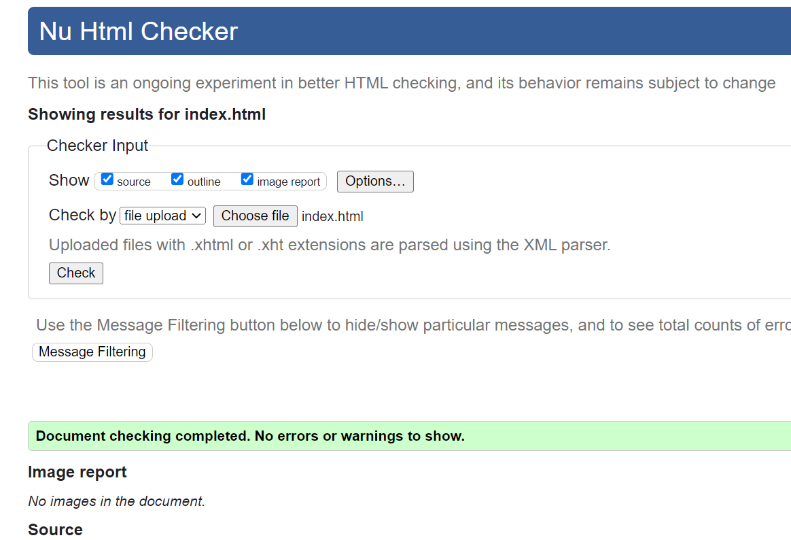
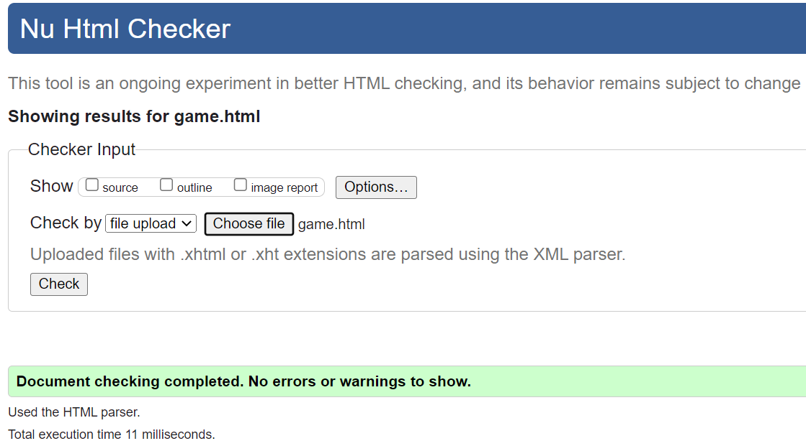
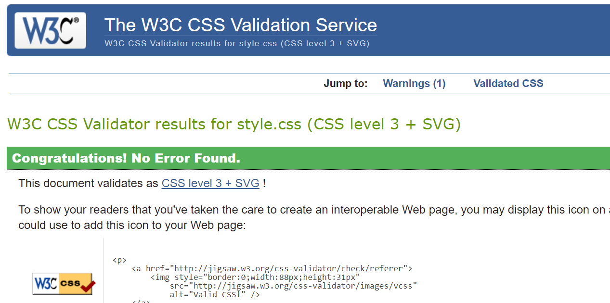

# **Purpose of the project**
.. 

 **To visit the live site click** [here](https://jawahir01.github.io/Bird-Hunt/)

## **Site Owner's Goals**
- 
  
## **External User's Goals**

# **UX Design**

## **Wireframes**

 - **Desktop Wireframe using Miro:**
    

 - **Tablet Wireframe using Miro:**
    

 - **Mobile Wireframe using Miro:**
    

## **Features**

 - **Header**
    ..
    

- **Footer**
    ..
    

- **Home Page**

  - 

- **404 Page**

    

## Future Features
-...

---

# **Typography and color scheme**

## **Colour Scheme**
...

## **Typography**
...
 
# **Technology**
 - ## **Languages Used**
    + HTML5
    + CSS3
    + JavaScript

 - ## **Frameworks, Libraries & Programs Used:**
    - **Bootstrap ???:**
    ...

    - **Google Fonts:**
    ...

    - **Font Awesome ???:**
    ....

    - **GitHub:**
    GitHub is used to store the projects code after being pushed from Git.

    - **Print 3D:**
    ....

    - **Canvas**
    canvas was used to create the logo.

    - **Miro:**
    Miro was used to create the wireframes during the design process.

# **Testing**

## **Code Validation**
- **HTML**
    - The index.html file was validated by using [HTML validater](https://validator.w3.org/#validate_by_upload)
     and no errors or warnings were found.

    - The game.html file was validated by using [HTML validater](https://validator.w3.org/#validate_by_upload)
     and the errors were about the  elements must have an alt attribute on each and after updating, no errors were found

- **CSS**
    The style sheet was validated by using [CSS validater](https://jigsaw.w3.org/css-validator/)
     and no errors or warnings were found.
    
## **User Story**

...

  

## **Test Cases**
...
 
 ---

## **Fixed Bugs**
- ### **Using Chrome Devtool:**
    - ...

- ### **Using Lighthouse**
    ...

# **Deployment**

- ### **Via github pages:**

    To deploy the page via github pges follow these steps:
    1. On GitHub, navigate to the repository https://???
    2. Click **Settings**.
    3. In the "Code and automation" section of the sidebar, click  Pages.
    4. Under "Build and deployment":
         - under "Source", select Deploy from a branch.
         - Under "Branch", Main Branch
    5. Click "Save".
    6. Refresh the page and shortly the live link of the website will appeare.

**The live link** https://???

# **Credits**

## **Content**
1. ...

## **Media**
1. ...

## **Acknowledgements**
1. ...
