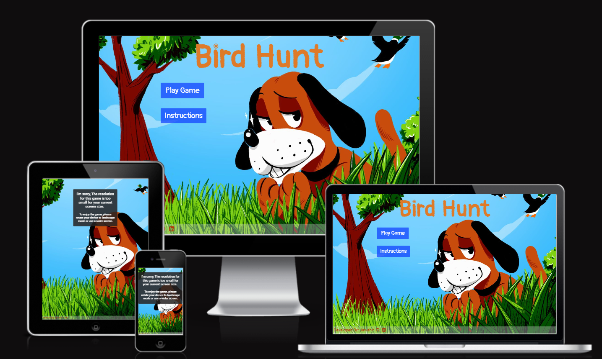

# **Bird Hunt Game**

Bird Hunt is a fun and challenging game where you can test your shooting skills. When building the game, I was inspired by the famous Duck Hunt game. So, I created my own version of hunting different kind of birds. The game is easy and I hope you like it.
- **NOTE** For mobile/small screen users you have to rotate your device in order to play the game.

 **To visit the live game click** [here](https://jawahir01.github.io/Bird-Hunt/)

## **Site Owner's Goals**
- 
  
## **External User's Goals**

# **UX Design**

## **Wireframes**

 - **Desktop Wireframe using Miro:**
    

 - **Tablet Wireframe using Miro:**
    

 - **Mobile Wireframe using Miro:**
    

## **Features**

- **Home Page**
    The main page has a background picture of a dog and ducks . The page title apears clearly as it centers the page. beneath there are two buttons; play game button that directs the end user to the Game page ans Instructions button that modals to how to play the game.
  - 

- **Game Page** It contains of ten animated pitures of birds. There are two updated texts of a scores (points) and bullets. There is also a timer with snadclock on it.
  - 

 - **Header**
    ..
    

- **Footer**
    The footer is at the bottom of the main page. It contains a text and two icons of social media links for the developer, and it clicked it will open in a new tap.
    

## Future Features
- Building different rounds for the game and adding diffcultis.
- Make it Online Multiplayer Game so that user can compete with his friends.

---

# **Typography and color scheme**

## **Colour Scheme**
...The color scheme in Duck Hunt is designed to create a sense of nostalgia and fun. The bright, primary colors are reminiscent of classic arcade games, and the overall aesthetic is simple and easy to understand. I used the blue background color with white text on the buttons to match the sky of the background image. I also used *** for the title, scores, results and the timer to help create a sense of excitement and challenge. 

## **Typography**
...The typography for the Bird Hunt game is clear and easy to read. I used "Pangolin" font which  is a sans-serif font that is designed for use in games. It is a high-contrast font that is easy to read on a variety of devices.

 
# **Technology**
 - ## **Languages Used**
    + HTML5
    + CSS3
    + JavaScript

 - ## **Frameworks, Libraries & Programs Used:**
    
    - **Bootstrap 5.2.3 and 5.3.0:**
    Bootstrap was used to assist with the responsiveness and styling of the website.

    - **Google Fonts:**
    Google fonts were linked into the html files throughout the project.
    
    - **Font Awesome 4.7.0:**
    Font Awesome was used on all pages throughout the website to add icons for aesthetic and UX purposes.

    - **GitHub:**
    GitHub is used to store the projects code after being pushed from Git.

    - **Print 3D:**
    Paint 3D was used to resizing images and editing photos for the website.

    - **Miro:**
    Miro was used to create the wireframes during the design process.

# **Testing**
## **Code Validation**
- **HTML**
    - The index.html file was validated by using [HTML validater](https://validator.w3.org/#validate_by_upload)
     and no errors or warnings were found.

    - The game.html file was validated by using [HTML validater](https://validator.w3.org/#validate_by_upload)
     and the errors were about the  elements must have an alt attribute on each and after updating, no errors were found

- **CSS**
    The style sheet was validated by using [CSS validater](https://jigsaw.w3.org/css-validator/)
     and no errors or warnings were found.
    
## **User Story**

...

  

## **Test Cases**
...
 
 ---

## **Fixed Bugs**
- ### **Using Chrome Devtool:**
    - ...

- ### **Using Lighthouse**
    ...

# **Deployment**

- ### **Via github pages:**

    To deploy the page via github pges follow these steps:
    1. On GitHub, navigate to the repository https://???
    2. Click **Settings**.
    3. In the "Code and automation" section of the sidebar, click  Pages.
    4. Under "Build and deployment":
         - under "Source", select Deploy from a branch.
         - Under "Branch", Main Branch
    5. Click "Save".
    6. Refresh the page and shortly the live link of the website will appeare.

**The live link** [here](https://jawahir01.github.io/Bird-Hunt/)

---

# **Credits**
 - ## **Content**
    1. ...
    ## **Media**
     ...
     ## **Acknowledgements**
     1. ...
