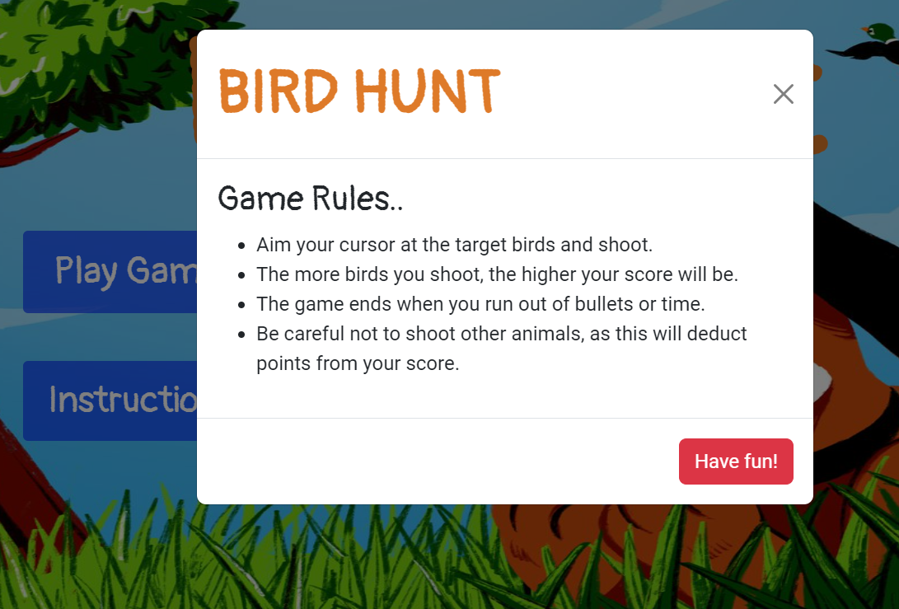

# **Bird Hunt Game**

Bird Hunt is a fun and challenging game where you can test your shooting skills. When building the game, I was inspired by the famous Duck Hunt game. So, I created my own version of hunting different kind of birds. The game is easy and I hope you like it have fun.

- **NOTE** This game is designed to be played on a wider screen size. If you are using a mobile device or other small screen, please rotate your device to landscape mode to ensure optimal gameplay.

 **To visit the live game click** [here](https://jawahir01.github.io/Bird-Hunt/).

# **Table Of Contents**
- [**Bird Hunt Game**](#bird-hunt-game)
- [**Table Of Contents**](#table-of-contents)
  - [**Site Owner's Goals**](#site-owners-goals)
  - [**External User's Goals**](#external-users-goals)
- [**UX Design**](#ux-design)
  - [**Wireframes**](#wireframes)
  - [**Features**](#features)
- [**Typography and color scheme**](#typography-and-color-scheme)
  - [**Colour Scheme**](#colour-scheme)
  - [**Typography**](#typography)
- [**Technology**](#technology)
- [**Testing**](#testing)
- [**Deployment**](#deployment)
- [**Credits**](#credits)

<small><i><a href='http://ecotrust-canada.github.io/markdown-toc/'>Table of contents generated with markdown-toc</a></i></small>

## **Site Owner's Goals**
- As a developer, I want to ensure that the game's design and sound effects are working well through out the game.
  
## **External User's Goals**
- ### **First time user**
   - I want to see a landing page that features slightly the old Duck Hunt game so that it trigger me into playing. Knowingly, it is a new version.
   
   - I want to easily know where to click the button to play the game. Then, click the play button.
   
  - I want to see the rules of the game.

  - I want to be able to shoot the animals when I click on them.

  - I want to progress through the game and see my points everythime I shoot.

  - I want to see how many bullets are left for me while shooting.

  - I want to see my final result when I finish.
  
  - I want to easly know how to contact the game developer

- ### **Regular User**
    As a returning user, I would like to receive different feedback for my scores at the end of the game.

# **UX Design**

## **Wireframes**

 - **Desktop/ Tablet/ Mobile Wireframe using Miro:**
    

## **Features**
- ### **Existing Features**
    - **Home Page**
    The main page of the game has a background image of a dog and flying birds. The page title, "Bird Hunt," is centered at the top of the page. Below the title are two buttons: "Play Game" and "Instructions." The "Play Game" button takes the user to the game page, while the "Instructions" button opens a modal window with instructions on how to play the game.
   

  - **Game Page** The game contains ten animated images of birds, as well as three different animals: a dragon, a crocodile, and a hippopotamus. The user's score is displayed in a text box current score. The user starts with ten bullets, and the number of bullets remaining is displayed below the score. A timer with an hourglass icon is displayed at the top of the screen, and it counts down from 15 seconds. The game ends when the timer runs out or when the user runs out of bullets.
   

   - **Game instructions**
  When the player clicks on Instruction button, a pop up box will appear on the screen to show the player the rules of the game.
  

   - **Result Box**
  When the player finishes all the bullets, a small box will pop up on the screen showing the player's final score and a feedback regarding his score, underneath there is a button for the player to play the game again.
  
   -  **End of Time Box**
    If the player ran out of time a small box will pop up on the screen informing that the time has finished. also,there is a button for the player tp play the game again.
    

  - **Footer**
    A slightly transparent footer is located at the bottom of the main page. It contains the following text and social media icons:
    - Text: The game developer.
    - Icons: github and LinkedIn
    

- ### **Future Features**
  - Building different rounds for the game and adding diffcultis.
  - Set a score record for the user everythime he plays and show his highest score recorded.

# **Typography and color scheme**

## **Colour Scheme**
 - The color scheme in Bird Hunt game is designed to create a sense of nostalgia and fun. The bright, primary colors are reminiscent of classic arcade games, and the overall aesthetic is simple and easy to understand. I used the blue background color with white text on the buttons to match the sky of the background image. I also used **#de7b29** Cherokee Dignity (shades) for the title, scores, results and the timer to help create a sense of excitement and challenge. 

## **Typography**
- The typography for the Bird Hunt game is clear and easy to read. I used "Pangolin" font which  is a sans-serif font that is designed for use in games. It is a high-contrast font that is easy to read on a variety of devices.

 
# **Technology**
 - ## **Languages Used**
    + HTML5
    + CSS3
    + JavaScript

 - ## **Frameworks, Libraries & Programs Used:**
    
    - **Bootstrap 5.2.3 and 5.3.0:**
    Bootstrap was used to assist with the responsiveness and styling of the website.

    - **Google Fonts:**
    Google fonts were linked into the html files throughout the project.
    
    - **Font Awesome 4.7.0:**
    Font Awesome was used on all pages throughout the website to add icons for aesthetic and UX purposes.

    - **GitHub:**
    GitHub is used to store the projects code after being pushed from Git.

    - **Print 3D:**
    Paint 3D was used to resizing images and editing photos for the website.

    - **Miro:**
    Miro was used to create the wireframes during the design process.
    - **Favicon:**
    [favicon generator](https://favicon.io/) was used to convert the image to the favicon format.

# **Testing**
For the testing documentations, please checck [TEST.md](/TEST.md)

# **Deployment**
- ### **Via github pages:**

    To deploy the page via github pges follow these steps:
    1. On GitHub, navigate to the repository https://github.com/Jawahir01/Bird-Hunt
    2. Click **Settings**.
    3. In the "Code and automation" section of the sidebar, click  Pages.
    4. Under "Build and deployment":
         - under "Source", select Deploy from a branch.
         - Under "Branch", Main Branch
    5. Click "Save".
    6. Refresh the page and shortly the live link of the website will appeare.

- ### **Local Deployment:**
    To run the code locally follow these steps:
    1. Login to your GitHub account.
    2. Search for the repository named: Jawahir01/ Bird-Hunt
    3. Click code toggle button and copy the url (https://github.com/Jawahir01/Bird-Hunt.git)
    4. In your IDE, open the terminal and run the code

    ##  
        git clone https://github.com/Jawahir01/Bird-Hunt.git
    The repository will now be cloned in your workspace.

    ### **The live link:** https://jawahir01.github.io/Bird-Hunt/index.html

# **Credits**
- ## **Content**
    1. I received help with my game idea from lessons on Code Institute and YouTube.
    2. The icons in the website were from [Font Awesome](https://fontawesome.com)
    3. The favicons in the website are from [Favicon](https://favicon.io/)
    4. The hourglass code from http://www.w3schools.com
    5. The footer code is edited using the footer sections from https://www.w3schools.com/bootstrap5/

- ## **Media**
     The images of the theme game background in the Home page, the background image of the game page, the favicon of the website, the birds and animals were from google image.

- ## **Acknowledgements**
     1. _Dave Horrocks_, Technical Content Reviewer in Code Institute.
     2. _Manuel Perez Romero_, My mentor at City of Bristol College.
     3. _Simen Daehlin_, Solutions Engineer & Student Mentor at Code Institute.
     4. _Rohit Sharma_, My Mentor Guidance at Code Institute.
