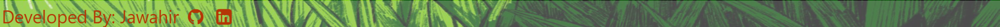

# **Bird Hunt Game**

Bird Hunt is a fun and challenging game where you can test your shooting skills. When building the game, I was inspired by the famous Duck Hunt game. So, I created my own version of hunting different kind of birds. The game is easy and I hope you like it.
- **NOTE** For mobile/small screen users ...

 **To visit the live game click** [here](https://jawahir01.github.io/Bird-Hunt/)

## **Site Owner's Goals**
- As a developer, I want to ensure that the game's design and sound effects are working well through out the game.
  
## **External User's Goals**
- ### **First time user**
   - I want to see a landing page that features slightly the old Duck Hunt game so that it trigger me into playing. Knowingly, it is a new version.
   
   - I want to easily know where to click the button to play the game. Then, click the play button.
   
  - I want to see the rules of the game.

  - I want to be able to shoot the animals when I click on them.

  - I want to progress through the game and see my points everythime I shoot.

  - I want to see how many bullets are left for me while shooting.

  - I want to see my final result when I finish.
  
  - I want to easly know how to contact the game developer

- ### **Regular User**
    As a returning user, I want to play the game and get different scores.

# **UX Design**

## **Wireframes**

 - **Desktop Wireframe using Miro:**
    

 - **Tablet Wireframe using Miro:**
    

 - **Mobile Wireframe using Miro:**
    

## **Features**
- ### **Existing Features**
    - **Home Page**
    The main page has a background picture of a dog and ducks . The page title apears clearly as it centers the page. beneath there are two buttons; play game button that directs the end user to the Game page ans Instructions button that modals to how to play the game.
   

  - **Game Page** It contains of ten animated pitures of birds. There are two updated texts of a scores (points) and bullets. There is also a timer with snadclock on it.
   

  - **Footer**
    The footer is at the bottom of the main page. It contains a text and two icons of social media links for the developer, and it clicked it will open in a new tap.
    

- ### **Future Features**
  - Building different rounds for the game and adding diffcultis.
  - Set a score record for the user everythime he plays and show his highest score recorded.

# **Typography and color scheme**

## **Colour Scheme**
 - The color scheme in Duck Hunt is designed to create a sense of nostalgia and fun. The bright, primary colors are reminiscent of classic arcade games, and the overall aesthetic is simple and easy to understand. I used the blue background color with white text on the buttons to match the sky of the background image. I also used **#de7b29** Cherokee Dignity (shades) for the title, scores, results and the timer to help create a sense of excitement and challenge. 

## **Typography**
- The typography for the Bird Hunt game is clear and easy to read. I used "Pangolin" font which  is a sans-serif font that is designed for use in games. It is a high-contrast font that is easy to read on a variety of devices.

 
# **Technology**
 - ## **Languages Used**
    + HTML5
    + CSS3
    + JavaScript

 - ## **Frameworks, Libraries & Programs Used:**
    
    - **Bootstrap 5.2.3 and 5.3.0:**
    Bootstrap was used to assist with the responsiveness and styling of the website.

    - **Google Fonts:**
    Google fonts were linked into the html files throughout the project.
    
    - **Font Awesome 4.7.0:**
    Font Awesome was used on all pages throughout the website to add icons for aesthetic and UX purposes.

    - **GitHub:**
    GitHub is used to store the projects code after being pushed from Git.

    - **Print 3D:**
    Paint 3D was used to resizing images and editing photos for the website.

    - **Miro:**
    Miro was used to create the wireframes during the design process.

# **Testing**
## **Code Validation**
- **HTML**
    - The index.html file was validated by using [HTML validater](https://validator.w3.org/#validate_by_upload)
     and no errors or warnings were found.

    - The game.html file was validated by using [HTML validater](https://validator.w3.org/#validate_by_upload)
     and the errors were about the  elements must have an alt attribute on each and after updating, no errors were found

- **CSS**
    - The style sheet was validated by using [CSS validater](https://jigsaw.w3.org/css-validator/)
     and no errors or warnings were found.

- **JavaScript**
    - The javascript file was validated by using [JS validater](https://jshint.com/)
    -  and no errors or warnings were found.
    

## **Manual Testing**
- On clicking the link I expect the user to land on the homepage. He should notice a background image, a centerd title a,two clickable buttons and a footer with two social media icons. It's been tested and working well.
- On clicking on the instruction button I expect a modal to popup and display the rules on how to play the game. It's been tested and working well.
- On hovering over the github and linkedin icons in the footer, I expect the icon to get slightly lighter and when clicking the icon, it should take me to the github/linkedin account for the developer. It's been tested and working well.
- On clicking on the play game button, I expect the user is taken to the game page. It's been tested and working well.
- On the game page, I expect the user to see birds flying in different directions and two animals poping up randomly on the screen every 1 second. It's been tested and working well.
- On the game page, I expect the user to see two texts: Score with number 0, Bullets with number 15 and a hourgalss timer icon beneath the texts with number 15. It's been tested and working well.
- On clicking on a bird, I expect the user to notice that the clicked bird disapeared, the number score rised, the bullets decremented by 1 and the timer is counting down. It's been tested and working well.
- On keep clicking on the birds, I expect the previous test to happen. It's been tested and working well.
- On clicking on dragon/hippo/crocodile, I expect the user to notice that the clicked animal disapeared, the number score decremented, the bullets decremented by 1 and the timer is counting down. It's been tested and working well.
- On clicking on the screen indecating that the user missed shooting the bird, I expect the user to hear a different sound, the score number is the same, the bullets decrements and the timer still counting down. It's been tested and working well.
- Once the bullets turn into 0, I expect the user to not be able to click any more on any bird left and a pop up message that has a short sentence with the user's score result and a button says paly again. It's been tested and working well.
- On clicking on the play again button, I expect the user to return to the main page again. It's been tested and working well.
- On the game page if the hourglass timer went down to 0, I exepect the user to not be able to click any more on any bird left and a pop up message that has a short sentence indecateing that the user has ran out of time and a paly again button. It's been tested and working well.
 

## **Fixed Bugs**

- ### **Using Lighthouse**
    - **Desktop**
   When ckecking the through lighthouse for desktop devices I got these results for the home page: 

    

    and for the game page:
    

    - **Mobile**
  When ckecking through lighthouse for mobile devices I got these results:

    

# **Deployment**
- ### **Via github pages:**

    To deploy the page via github pges follow these steps:
    1. On GitHub, navigate to the repository https://github.com/Jawahir01/Bird-Hunt
    2. Click **Settings**.
    3. In the "Code and automation" section of the sidebar, click  Pages.
    4. Under "Build and deployment":
         - under "Source", select Deploy from a branch.
         - Under "Branch", Main Branch
    5. Click "Save".
    6. Refresh the page and shortly the live link of the website will appeare.

- ### **Local Deployment:**
    To run the code locally follow these steps:
    1. Login to your GitHub account.
    2. Search for the repository named: Jawahir01/ Bird-Hunt
    3. Click code toggle button and copy the url (https://github.com/Jawahir01/Bird-Hunt.git)
    4. In your IDE, open the terminal and run the code

    ##  
        git clone https://github.com/Jawahir01/Bird-Hunt.git
    The repository will now be cloned in your workspace.

    ### **The live link:** https://jawahir01.github.io/Bird-Hunt/index.html

# **Credits**
- ## **Content**
    1. The icons in the website were from [Font Awesome](https://fontawesome.com)
    2. The footer code is edited using the footer sections from https://www.w3schools.com/bootstrap5/

- ## **Media**
     The images of the theme game background in the Home page, the background image of the game page,  birds and animals were from google image.

- ## **Acknowledgements**
     1. _Dave Horrocks_, Technical Content Reviewer in Code Institute.
     2. _Manuel Perez Romero_, My mentor at City of Bristol College.
     3. _Simen Daehlin_, Solutions Engineer & Student Mentor at Code Institute.
     4. _Rohit Sharma_, My Mentor Guidance at Code Institute.
