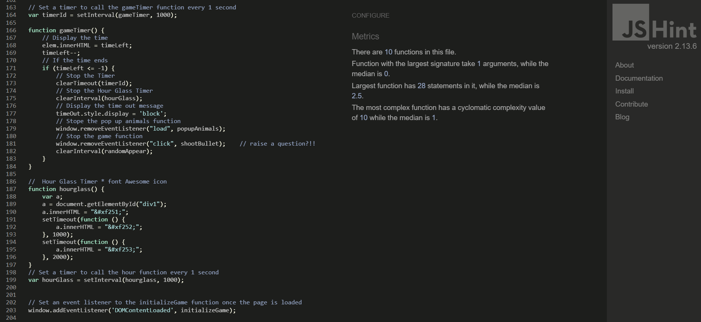
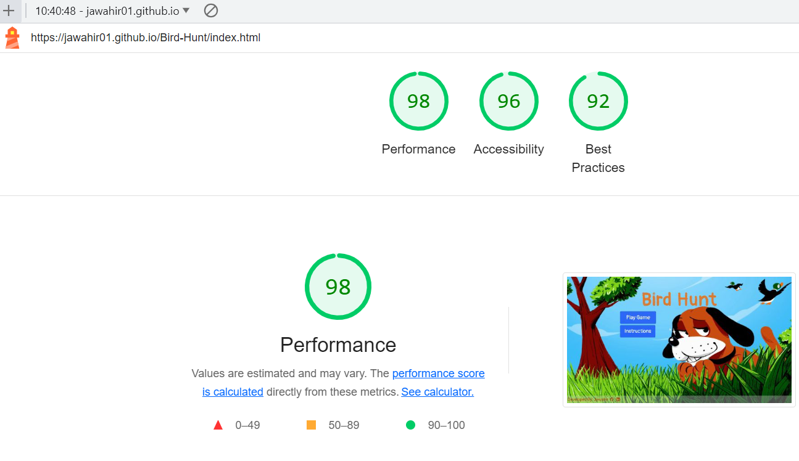
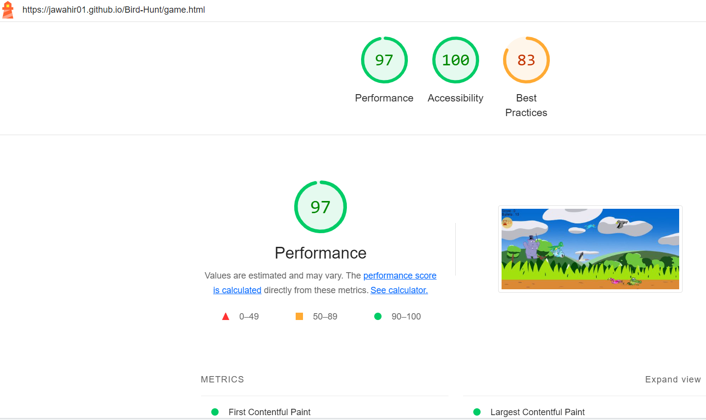

# **Testing**
## **Code Validation**
- **HTML**
    - The index.html file was validated by using [HTML validater](https://validator.w3.org/#validate_by_upload)
     and no errors or warnings were found.

    - The game.html file was validated by using [HTML validater](https://validator.w3.org/#validate_by_upload)
     and the errors were about the  elements must have an alt attribute on each and after updating, no errors were found

- **CSS**
    - The style sheet was validated by using [CSS validater](https://jigsaw.w3.org/css-validator/)
     and no errors or warnings were found.

- **JavaScript**
    - The javascript file was validated by using [JS validater](https://jshint.com/)
    -  and no errors or warnings were found.
    

## **Manual Testing**
- On clicking the link I expect the user to land on the homepage. He should notice a background image, a centerd title a,two clickable buttons and a footer with two social media icons. It's been tested and working well.
- On clicking on the instruction button I expect a modal to popup and display the rules on how to play the game. It's been tested and working well.
- On hovering over the github and linkedin icons in the footer, I expect the icon to get slightly lighter and when clicking the icon, it should take me to the github/linkedin account for the developer. It's been tested and working well.
- On clicking on the play game button, I expect the user is taken to the game page. It's been tested and working well.
- On the game page, I expect the user to see birds flying in different directions and two animals poping up randomly on the screen every 1 second. It's been tested and working well.
- On the game page, I expect the user to see two texts: Score with number 0, Bullets with number 15 and a hourgalss timer icon beneath the texts with number 15. It's been tested and working well.
- On clicking on a bird, I expect the user to notice that the clicked bird disapeared, the number score rised, the bullets decremented by 1 and the timer is counting down. It's been tested and working well.
- On keep clicking on the birds, I expect the previous test to happen. It's been tested and working well.
- On clicking on dragon/hippo/crocodile, I expect the user to notice that the clicked animal disapeared, the number score decremented, the bullets decremented by 1 and the timer is counting down. It's been tested and working well.
- On clicking on the screen indecating that the user missed shooting the bird, I expect the user to hear a different sound, the score number is the same, the bullets decrements and the timer still counting down. It's been tested and working well.
- Once the bullets turn into 0, I expect the user to not be able to click any more on any bird left and a pop up message that has a short sentence with the user's score result and a button says paly again. It's been tested and working well.
- On clicking on the play again button, I expect the user to return to the main page again. It's been tested and working well.
- On the game page if the hourglass timer went down to 0, I exepect the user to not be able to click any more on any bird left and a pop up message that has a short sentence indecateing that the user has ran out of time and a paly again button. It's been tested and working well.
 

## **Fixed Bugs**
- I had this bug issue where the game page used to zoon in and out after 4 seconds of the game.
    

    to fix the issue I added the positioning the img element:

        img{
            postion: fixed;
        }
        and now the problem is solved.

- ### **Using Lighthouse**
    - **Desktop**
   When ckecking the through lighthouse for desktop devices I got these results for the home page: 

    

    and for the game page:
    

    - **Mobile**
  When ckecking through lighthouse for mobile devices I got these results:

    
    and for the game page:
    
